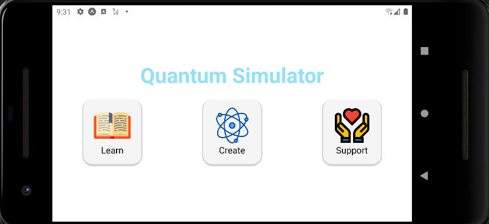
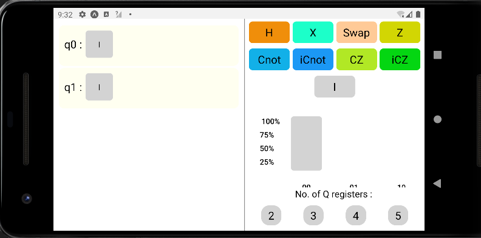
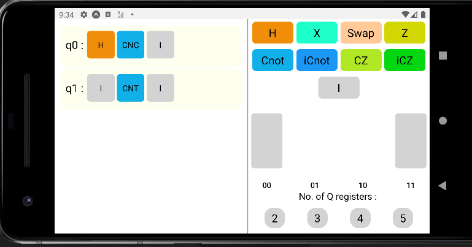
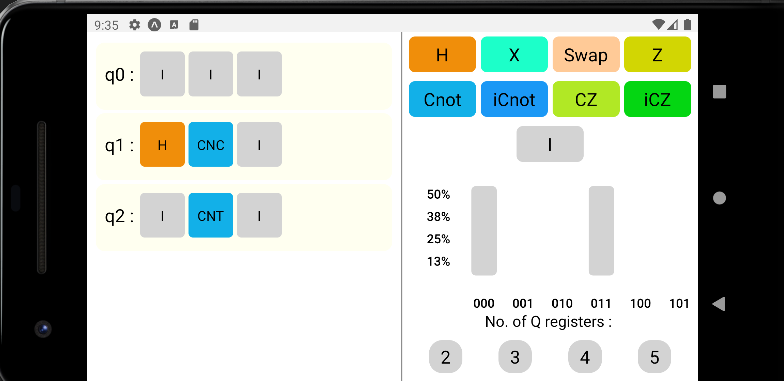
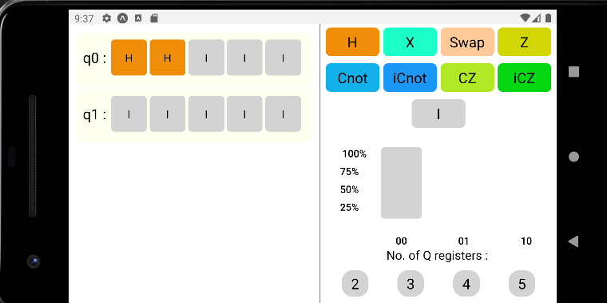

# Quantum Computer Simulator

Quantum Computer Simulator is a mobile application built with React Native Expo for simulating quantum algorithms and circuits. It provides a platform for understanding and experimenting with quantum computing concepts on mobile devices.

## Features

- **Quantum Circuit Simulation**: Simulate quantum circuits composed of quantum gates.
- **Quantum Algorithm Implementation**: Implement and run various quantum algorithms.
- **Visualization**: Visualize quantum circuits and their execution.
- **Mobile Compatibility**: Accessible on both iOS and Android devices.
- **Educational Purposes**: Suitable for learning and experimenting with quantum computing on the go.

## Installation

To run the Quantum Computer Simulator on your local machine, follow these steps:

1. Ensure you have Node.js and npm installed on your system.
2. Install the Expo CLI globally:
   ```bash
   npm install -g expo-cli
   ```
3. Clone the repository:
   ```bash
   git clone https://github.com/Akashram28/Quantum-Computer-Simulator.git
   ```
4. Navigate to the project directory:
   ```bash
   cd Quantum-Computer-Simulator
   ```
5. Install the dependencies:
   ```bash
   npm install
   ```

## Usage

  To start the Expo development server and run the app on your local machine, use the following command:
  ```bash
   npm start
   ```
  Then run the simulator on your android/ios emulator or run it locally on the Expo app.
  
## Screenshots



*Home Screen*



*Circuit Maker*



*Quantum Entanglement Circuit with 2 qubits*



*Quantum Entanglement between 2 qubits in a 3 qubit circuit*



*H-H Cirucuit*
